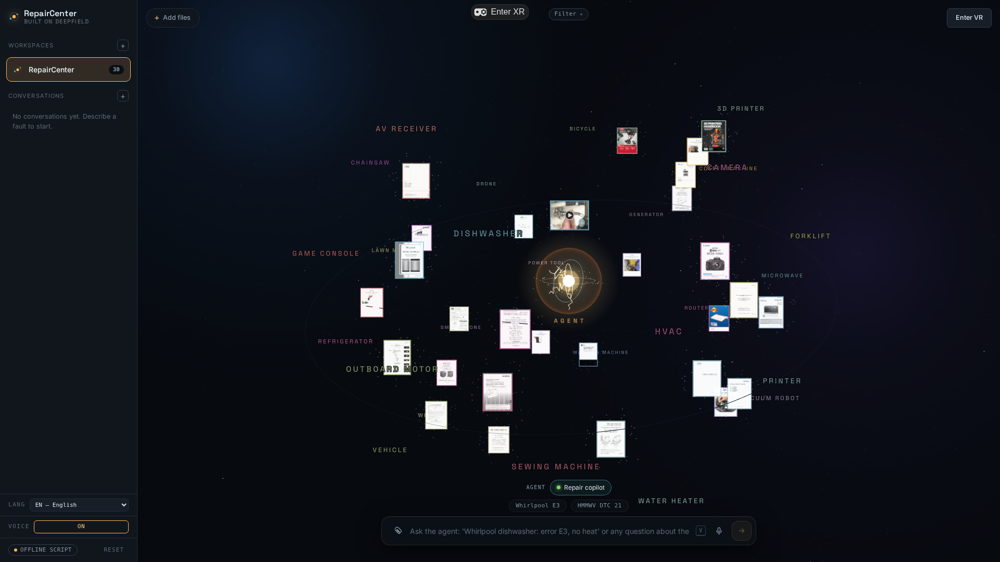
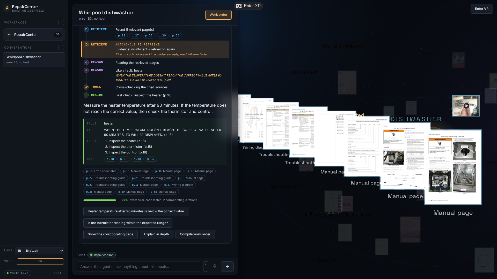
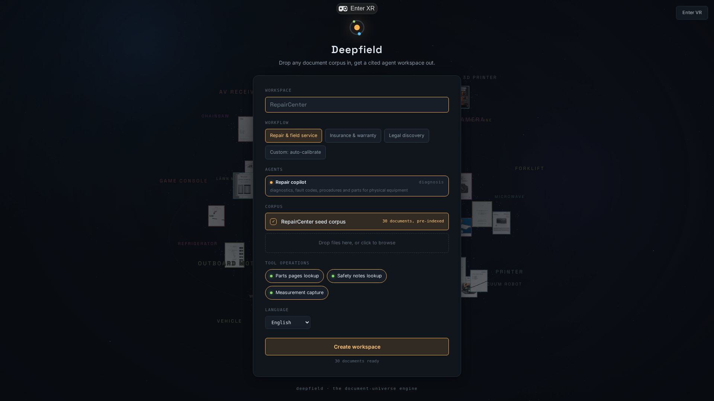

# RepairCenter

A manual-agnostic, document-grounded repair agent. Built solo in 24 hours for the RAISE Summit
hackathon (Statement Two, Vultr track): every commit in this repo, from the first scaffold to
the last polish, was written during the event.

Drop in any repair documentation: service manuals, user guides, scanned military TMs, iFixit
guides, even videos. The agent reads every page as an image, classifies each document, and
auto-organizes the whole corpus into a knowledge base rendered as a navigable 3D universe of
files. A technician then describes a fault in any language. The agent plans, retrieves the right
pages visually, decides on its own when the evidence is not sufficient, reads schematics, calls
tools (parts stock, measurements), and delivers a cited step-by-step repair path with an
explained confidence score. Every claim links to the exact page, table row, wiring fold-out or
video second it came from.



*The corpus after ingest: every document classified and placed into constellations, the agent core at the center.*

The 3D universe is not decoration: it is the retrieval made visible. When the agent searches,
lightning probes the candidate files; when it cites, the real pages fan out in space; documents
outside the conversation scope fade to ghosts.



*A live run on Vultr: the agent re-retrieves on its own, delivers a cited verdict with an explained confidence score, and the cited pages fan out in space.*

## Models (all on Vultr Serverless Inference)

| Role | Model |
|---|---|
| Visual retrieval (two-stage rerank over page images) | vultr/VultronRetrieverPrime-Qwen3.5-8B |
| Everything the agent thinks: planning, sufficiency, vision diagnosis, translation | nvidia/Nemotron-3-Nano-Omni-30B-A3B-Reasoning-BF16 |

There is no vector store and no OCR pipeline in the retrieval path. Stage 1 narrows candidates by
taxonomy scope plus a lexical prefilter; stage 2 lets VultronRetriever score the actual page
images against the query. Scanned schematics and fold-outs rank correctly because the pages are
seen, not text-extracted.

### One NVIDIA model does all the thinking

Every reasoning step (planning, routing between team agents, sufficiency judging, multimodal
diagnosis over schematics and technician photos, grounded answers, in-place translation) runs
on a single NVIDIA Nemotron 3 Nano Omni 30B-A3B served by Vultr. Measured on this workload it
parses reliably and answers 2-3x faster than the larger generalist alternative once its hidden
reasoning is kept on a short leash: every prompt carries a brevity directive, and degressive
retry ladders absorb the token-cap and gateway-timeout regimes.

The voice loop is NVIDIA end to end. Hold V and NVIDIA Parakeet (multilingual ASR, answers in
half a second) sends your words straight to the agent; with VOICE on, verdicts are spoken
through NVIDIA Magpie TTS Multilingual. Both ride a small gRPC relay (`tools/tts-relay/`, the
hosted speech APIs are gRPC-only); if the relay is down, TTS falls back to Vultr, then to the
browser, and the mic button hides rather than pretend.

##  Beyond repair: the Deepfield engine

Nothing in the engine is repair-specific. Visual retrieval over page images, automatic
taxonomy, the navigable 3D universe and page-exact citations work on any document corpus.
RepairCenter is the first app built on Deepfield: open the Studio (`/?studio`), name a
workspace, drop a corpus, wire your tools, and the same plan-retrieve-cite loop serves legal
discovery, clinical-trial matching or telecom field operations. Calibration writes the whole
workspace: Nemotron designs the agent team and its operations from the corpus and your intent
sentence, and each request is routed to the right specialist inside the plan call itself, at
zero extra inference cost.



*Deepfield Studio (`/?studio`): the workspace creation screen. The universe populates live behind the card as the corpus is selected.*

## Multilingual by design

The technician picks any of 27 languages. The agent narrates its plan, its retrieval decisions
and its diagnosis in that language, while retrieval queries are always planned in English so the
search stays sharp on an English corpus (VultronRetriever is natively cross-lingual for its six
core languages). Any page can be translated in place: layout blocks come from the PDF text layer
(pixel-true positions extracted at ingest), Nemotron translates the words, and the patches
inherit the original type size, background and alignment. Only the words change. Scans without a
text layer fall back to a side-pane read of the page image.

## Run it

```
npm install
npm run demo        # offline agent loop in the terminal, no API key needed
npm run dev         # web app on http://localhost:5173 (?driver=fake = offline script, no key)
npm test            # 105 unit tests (agent loop, taxonomy, teams, confidence rubric)
```

With a Vultr Serverless Inference key the same UI runs live: put the key in `.env`
(`VULTR_INFERENCE_API_KEY`, `VULTR_BASE_URL`), then open `/?driver=vultr`. The dev server (and
the production proxy in `functions/api/agent.ts`) forwards only `/chat/completions` and
`/rerank`; the key never reaches the browser.

## Deploy it (live demo: https://deepfield.repairmind.io)

The production target is a plain Vultr Cloud Compute VM, one command:

```
./deploy/deploy.sh root@<vm-ip>   # build, sync, systemd service, port 80
```

`deploy/server.mjs` is a zero-dependency Node server: static build, gzip, the same
inference proxy allowlist, and optional multi-user mode. With `AUTH_ENABLED=1` in `.env`,
anyone can create an account and test within a per-account daily inference budget
(`USER_DAILY_LIMIT`, default 150 calls) under a global ceiling (`GLOBAL_DAILY_LIMIT`);
passwords are scrypt-hashed, sessions are HMAC-signed HttpOnly cookies, and each account
gets a small server-side store so its workspaces follow it across browsers. Prefer a
private link instead? Set `DEMO_TOKEN=<secret>` and share `http://<vm-ip>/?key=<secret>`.
On a fresh Vultr Ubuntu image, open the web ports once: `ufw allow 80/tcp && ufw allow 443/tcp`.

Voice is optional and runs on the NVIDIA speech relay: `cd tools/tts-relay && python -m venv venv
&& venv/bin/pip install -r requirements.txt && venv/bin/python serve.py`, with `NVIDIA_API_KEY`
in the app `.env` (generate one on build.nvidia.com).

## Corpus

The demo universe ships 30 documents across 26 device categories, ingested at FULL depth
(thousands of pages): complete service and user manuals, military TMs, a repair video with
chapter-accurate citations. Retrieval cost does not grow with corpus size: the two-stage
design always sends at most 24 page images to the visual reranker per query. `npm run ingest`
rebuilds `public/corpus/` from `corpus/manifest.json` (pages rendered at 120 DPI, text layer
and layout blocks extracted per page, video chapters mapped to timestamped segments). The
generated corpus is a build artifact and is not versioned in this repo.

Sources and rights for every document are listed in [SOURCES.md](SOURCES.md). Nothing is
re-hosted that should not be: videos play in the official embedded player.

## Architecture

```
src/agent/      loop.ts (plan, retrieve xN, reason, tools, decide), taxonomy, confidence
src/vultr/      client.ts (VultrDriver: two-stage visual retrieval, diagnosis, translation)
src/web/        React app: 3D universe (react-three-fiber), conversation panel, viewer
functions/      stateless API proxy (allowlist, rate limit, no key in browser)
scripts/        corpus ingest (pdftoppm, pdftotext -bbox, yt-dlp chapters, ffmpeg frames)
tools/          NVIDIA speech relay (gRPC bridge: Parakeet ASR in, Magpie TTS out)
```

The whole agent runs through one seam (`ModelDriver`): a scripted offline driver for
deterministic tests and demos, and the live Vultr driver. Same loop, same UI, same events.

## Path to production

The engine is already shaped for multi-tenant deployment: everything that defines a
workspace (agent team, workspace operations, corpus manifest) is plain serializable data,
and the whole agent sits behind two seams (`ModelDriver` for inference, one `docs.json`
fetch for the corpus). Making it enterprise-ready is perimeter work, not a rewrite:

- **Identity and organizations.** The demo deployment already ships real accounts:
  `AUTH_ENABLED=1` on the VM server turns on signup/login (scrypt, HMAC-signed sessions),
  a per-user store that follows the account across browsers, and per-account daily
  inference quotas. The enterprise step up is an IdP (Keycloak self-hosted, or WorkOS for
  SSO/SAML) with organizations owning workspaces and role-based membership (admin,
  technician, viewer).
- **Database: Vultr Managed PostgreSQL.** The schema is already drawn by the code:
  `workspaces(id, org_id, name, team JSONB, ops JSONB)` is the in-app `WorkspaceSnapshot`,
  conversations persist their steps with the full reasoning timeline (a structured audit
  trail for free), plus documents, pages and work orders.
- **Files and corpora: Vultr Object Storage.** One prefix per workspace: originals,
  rendered pages, manifests. The in-browser ingestion pipeline (render, classify, tag,
  background deepening) moves to a server worker unchanged in logic.
- **Quotas and limits.** Per-user upload quota (the app already enforces 100 MB per user),
  per-organization inference rate limits, and the existing API proxy allowlist. The
  inference key never reaches a browser today and never would.

Estimated at two to four weeks for a first multi-tenant MVP, with the agent loop itself
untouched.
